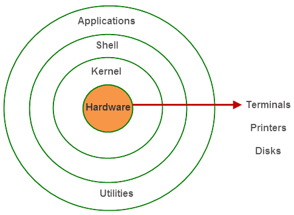
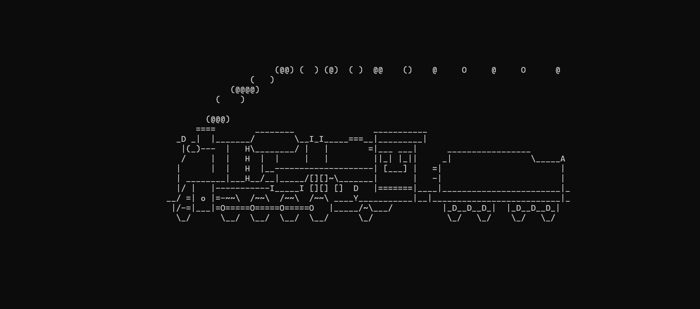

## The Linux Beginner's Guide

### What is Linux 🤔

Linux is a family of Unix-like OSs based on the Linux Kernel. Linux Kernel is a monolithic kernel with a modular design. Here is a a simplified architecture of the Linux Operating System.


When you boot up your own Linux Distro system (more on this later), you are utilizing the User Space which is were your User Applications and [glibc](https://www.gnu.org/software/libc/libc.html) (Used for implementing functions such as fopen(), calloc(),open()) exist. User Space interacts with the Kernel Space mainly via the System Call Interface.

System Call is how Userspace software requests service from the Kernel. Interface implements basic functions such as `read` and `write` . Typically, Sys Calls rely on Software Interrupts (SI). The SI will transfer control to the Kernel. If you've studied Computer Architecture and Organization, you might recall Software Interrupts as a signal to the kernel signaling that a certain even has taken place. You can read more about Software Interrupts [here](http://www.linfo.org/software_interrupt.html#:~:text=A%20software%20interrupt%2C%20also%20called,a%20program%20in%20user%20mode.) and about how Sys Calls are implemented [here](https://en.wikipedia.org/wiki/System_call#Typical_implementations).

Below that is your Kernel, which has a number of subsystems. We have used the term Kernel quite a few times, let's talk a little bit about what a Kernel is.

Kernels are computer programs that are responsible for low-level tasks: Disk Management, Task Management and stuff. It provides an interface between the user and the hardware components of the system. 



There are various different types of Kernels, here's a few:

1. Monolithic: MS-DOS, Unix, Linux

2. Microkernel: GNU Hurd

3. Hybrid Kernel: Windows NT (The kernel behind Windows Operating Systems)

4. Nanokernel: KeyKOS 

   


One of my favorite pieces on this topic is [this article](https://developer.ibm.com/technologies/linux/articles/l-linux-kernel/#:~:text=Architecture%2Ddependent%20code,-While%20much%20of&text=For%20a%20typical%20desktop%2C%20the,in%20.%2Flinux%2Farch.) by IBM. Some of the material found here is a condensed version of the that article. 

Finally, the architecture dependent code: Majority of Linux Code is architecture-independent, there are certain parts of the Linux Codebase which needs to be optimized to the architecture it runs on. This part of the code does exactly that. 


**So why Linux**?

We assume that if you've read thus far, you might have some answer to this question, but we will try to convince you a little more. 

Servers, Gaming Consoles, Spaceships - all use Linux in some way or another. Our Chairperson '21, Tej wrote a piece discussing the [utility of Linux in everyday life](https://medium.com/vit-linux-user-group/can-linux-be-used-for-everyday-purpose-369bb739c3ad) and the founder of VIT Linux User Group has written an article introducing Linux from a User's perspective [here](https://medium.com/vit-linux-user-group/im-a-cs-undergraduate-and-i-haven-t-used-windows-in-two-years-e79c6a8ac948). Our Core Committee Member, Sarthak has written a 2-part article on [how to get started with Linux](https://medium.com/vit-linux-user-group/introduction-to-linux-part-1-first-blood-3cd248b8ede0).

<hr>

**How is it different from Windows**

- Linux is Open Source, Windows is not. It is secure, and it is easy to detect and fix bugs. 
- Linux File System works differently than Windows. Where Windows has different data drives (C drive, E drive etc.), in Linux files are ordered in a tree structure as such. 


Even Peripherals in Linux are treated as files, unlike Windows, who classifies    devices as devices and so on and so forth and 

- Windows has 4 types of Users: Admin, Std, Child & Guest, where Linux has Root, Regular and Service.

<hr>

Now that you have a basic idea about Linux, let's choose a Linux Distro for you.

**Linux Distros**: Linux Operating System isn't developed or copyrighted by one single organization. There are lots of parts to a Linux System: Terminal, xServer, Desktop Environment etc. are all developed independently, sometimes by different organizations. If you wanted, you could build everything from source and get yourself a new Linux Distro, but we discourage that when you're just starting off since it requires a mammoth amount of work.

Instead, you could go with one of the many Linux Distros (Short for Distributions). These Linux Distros take all the code, build it and combine them into a single Operating System for you.


To find the right Distro for you, you can use: https://librehunt.org/

Be sure to consult other people in Linux forums and subreddits for your doubts. You can also leave a message to VIT Linux User Group via the Issues page on our [Github Repo]() and we will try to get back to you.

**Installing a Linux Distro**

Once you have chosen your first distro, you will now have to install it. There are multitude of ways to do so. To first try out the operating system, you can use [Virtual Machines](https://www.howtogeek.com/196060/beginner-geek-how-to-create-and-use-virtual-machines/) or if you're on Windows, you can try the [WSL2](https://devblogs.microsoft.com/commandline/wsl2-will-be-generally-available-in-windows-10-version-2004/). It is suggested that for any serious use, you install your chosen Distro natively. To do so, you can refer to the following [article](https://www.educba.com/install-linux/). Do not keep passwords that are too complex since you will need them frequently, but do not keep it too simple either.

<hr>

## The Linux Cheat Sheet

### The Terminal



The terminal in Linux is where most of the work happens (apart from your Browser where you will spend hours on Reddit 😛). The Terminal has a lot of useful tools, but we will start by doing the silly things.

What you see in the picture above is the locomotive command that drives a train through your screen. To install it, open your terminal (usually pretty easy) and type the following command.

```shell
$  apt-get install sl
```

It might give you one of two errors: `Permission Denied` or `Command Not Found`. 

`Permission denied` occurs when your terminal does not have the privilege to access certain files or perform certain commands. To deal with this, you can use `sudo` here, but **do not** always [depend on `sudo`](https://www.beyondtrust.com/blog/entry/unix-linux-privileged-management-should-you-sudo#:~:text=Whenever%20a%20user%20tries%20to,to%20give%20system%20based%20permissions.). 

`Sudo` is a command that allows you to run programs with the security privileges of another user, but by default, that other user is `root`, the "superuser" of the Linux System. You will be prompted for your password that you kept while installing.

```shell
$  sudo apt-get install sl
```

`Command Not Found` occurs when your Distro does not use apt-get and uses some other method. I personally use Debiam, for which `apt-get` works fine, but CentOS for example uses `dnf`. An easy way to figure out your system's packaging tool is to Google it. In fact that will be your solution to everything.


Once installed, you should type in the following.

```shell
$ sl
```

And you will find the locomotive running through your screen. Congratulations!

Now, you have learned about the following

1. Sudo
2. Installing stuff and Package Management (apt-get, dnf etc.)
3. Running a command on the terminal

#### Now let's play around with the Files

We already talked a little about [Linux File Systems](https://opensource.com/life/16/10/introduction-linux-filesystems)

<hr>

**Written with 💘 by [VIT Linux User Group](https://github.com/vitlug).**

Linux User's Group helps to understand the benefits of open source software over proprietary software. To create awareness and train users to go for open source software. To accelerate development and deployment of free and open source technologies, and beyond. Free to use, free to study, free to distribute, free to modify, free to access. Familiarize Students with Linux Distributions, Create awareness about FOSS, Learn general software on Linux such as GIMP, Libre Office, To present Linux as an efficient tool in Cyber security, Get students to contribute to FOSS, Make students more industry ready and to promote Linux in General.


